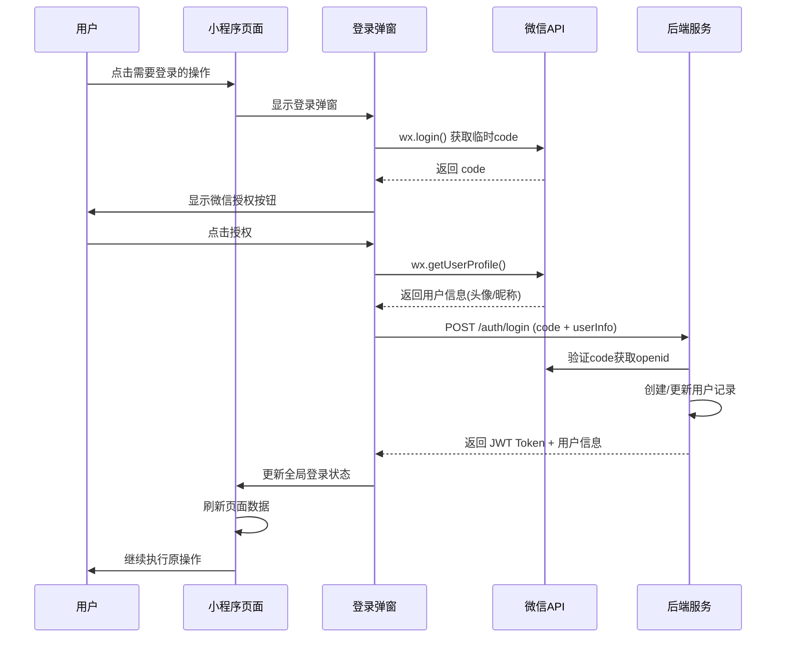

# 小程序登录功能需求方案

## 产品背景

当前小程序已搭建好登录基础框架（后端JWT认证、前端请求拦截器），但前端尚未实现实际的微信登录流程。需要实现"游客浏览 + 登录保护"的功能模式，让未登录用户可以浏览产品，但在使用核心功能时要求登录。

---

## 一、用户旅程设计

```
┌─────────────────────────────────────────────────────────┐
│  游客模式（未登录）                                        │
│  ├── 可浏览：首页静态展示、示例卡组、介绍文案               │
│  └── 触发登录：点击复习/添加卡组/拍照/个人中心              │
└─────────────────────────────────────────────────────────┘
                              │
                              ▼
┌─────────────────────────────────────────────────────────┐
│  一键登录弹窗                                             │
│  ├── 获取微信头像和昵称                                    │
│  ├── 一键授权完成注册登录                                  │
│  └── 登录后刷新页面，展示真实数据                          │
└─────────────────────────────────────────────────────────┘
                              │
                              ▼
┌─────────────────────────────────────────────────────────┐
│  登录模式                                                │
│  ├── 展示：用户真实头像、学习数据、个人卡组                │
│  └── 功能：完全访问所有操作                                │
└─────────────────────────────────────────────────────────┘
```

---

## 二、登录触发场景

| 页面/功能    | 操作                  | 未登录状态     | 登录后操作         |
| ------------ | --------------------- | -------------- | ------------------ |
| **首页**     | 点击"开始复习"按钮    | 显示登录弹窗   | 跳转到复习页面     |
| **首页**     | 点击底部"拍照"按钮    | 显示登录弹窗   | 打开相机/相册      |
| **首页**     | 点击卡组卡片          | 显示登录弹窗   | 跳转到卡组详情     |
| **卡组库**   | 点击"添加卡组"按钮    | 显示登录弹窗   | 打开创建卡组页面   |
| **个人中心** | 查看个人资料          | 显示登录引导页 | 显示用户信息和统计 |
| **任意页面** | 需要调用需要鉴权的API | 显示登录弹窗   | 正常执行API调用    |

---

## 三、登录流程设计

### 3.1 流程图



### 3.2 关键步骤

1. **获取临时凭证**：`wx.login()` 获取 code
2. **用户授权**：`button open-type="getUserInfo"` 获取用户头像和昵称
3. **后端登录**：调用 `/auth/login` 接口，传入 code 和用户信息
4. **保存凭证**：后端返回 JWT token，保存到本地存储
5. **更新状态**：更新全局登录状态，通知页面刷新
6. **继续操作**：执行登录前被拦截的操作

---

## 四、页面状态对比

### 4.1 首页 - 游客模式 vs 登录模式

| 元素           | 游客模式                                    | 登录模式               |
| -------------- | ------------------------------------------- | ---------------------- |
| **头像**       | 显示默认头像                                | 显示微信头像           |
| **昵称**       | 显示"访客"                                  | 显示微信昵称           |
| **问候语**     | "欢迎来到AI记忆卡"                          | "早安，[昵称]"         |
| **今日待复习** | 显示引导文案"登录后查看"                    | 显示真实数字           |
| **卡组列表**   | **显示3个示例卡组**（仅展示，点击触发登录） | 显示真实卡组（可点击） |
| **操作按钮**   | 点击触发登录                                | 正常跳转               |

### 4.2 卡组库页面

| 元素         | 游客模式                       | 登录模式         |
| ------------ | ------------------------------ | ---------------- |
| **卡组列表** | 显示空状态引导"登录后查看卡组" | 显示真实卡组列表 |
| **添加按钮** | **隐藏**，游客无法创建卡组     | 正常显示创建表单 |

### 4.3 个人中心页面

| 元素         | 游客模式         | 登录模式         |
| ------------ | ---------------- | ---------------- |
| **头部**     | 显示登录引导卡片 | 显示用户信息卡片 |
| **统计数据** | 显示"--"占位     | 显示真实数据     |
| **功能菜单** | 隐藏或置灰       | 正常显示可用     |

---

## 五、技术实现要点

### 5.1 登录状态管理

```typescript
// app.ts 全局状态
App({
  globalData: {
    userInfo: undefined,
    isLoggedIn: false,
    token: "",
  },

  // 登录成功后更新状态
  setLoginState(userInfo, token) {
    this.globalData.userInfo = userInfo;
    this.globalData.isLoggedIn = true;
    this.globalData.token = token;
    wx.setStorageSync("token", token);
    wx.setStorageSync("userInfo", userInfo);
  },
});
```

### 5.2 统一登录弹窗组件

```typescript
// components/login-modal/login-modal.ts
Component({
  data: {
    visible: false,
    pendingAction: null, // 存储登录后要执行的操作
  },

  methods: {
    // 显示弹窗并保存待执行的操作
    show(callback) {
      this.setData({ visible: true, pendingAction: callback });
    },

    // 处理微信授权登录
    onGetUserInfo(e) {
      if (e.detail.errMsg.includes("fail")) {
        // 用户拒绝授权
        wx.showToast({ title: "需要授权才能使用", icon: "none" });
        return;
      }

      this.performLogin(e.detail.userInfo);
    },

    // 执行登录流程
    async performLogin(userInfo) {
      // 1. 获取临时code
      const { code } = await wx.login();

      // 2. 调用后端登录
      const res = await request({
        url: "/auth/login",
        method: "POST",
        data: { code, userInfo },
        needAuth: false,
      });

      // 3. 保存登录状态
      app.setLoginState(res.userInfo, res.token);

      // 4. 关闭弹窗并执行原操作
      this.setData({ visible: false });
      if (this.data.pendingAction) {
        this.data.pendingAction();
      }

      // 5. 通知页面刷新
      this.triggerEvent("loginSuccess");
    },
  },
});
```

### 5.3 登录守卫工具函数

```typescript
// utils/auth.ts
const app = getApp();

/**
 * 检查是否已登录，未登录则显示登录弹窗
 * @param callback 登录成功后执行的回调
 * @returns boolean 是否已登录
 */
export function requireLogin(callback?: Function): boolean {
  if (app.globalData.isLoggedIn) {
    callback?.();
    return true;
  }

  // 显示登录弹窗
  const pages = getCurrentPages();
  const currentPage = pages[pages.length - 1];
  const loginModal = currentPage.selectComponent("#loginModal");

  if (loginModal) {
    loginModal.show(callback);
  }

  return false;
}
```

### 5.4 API 鉴权策略

| 接口类型     | 示例接口               | 鉴权要求              |
| ------------ | ---------------------- | --------------------- |
| **公开接口** | 获取示例卡组、首页介绍 | needAuth: false       |
| **私有接口** | 获取我的卡组、提交复习 | needAuth: true (默认) |

```typescript
// utils/request.ts
export function request<T>(options: RequestOptions): Promise<T> {
  const header: any = { "Content-Type": "application/json" };

  // 默认需要鉴权，除非显式设置 needAuth: false
  if (options.needAuth !== false && app.globalData.token) {
    header["Authorization"] = `Bearer ${app.globalData.token}`;
  }

  // ... 其余逻辑
}
```

---

## 六、用户体验细节

### 6.1 登录弹窗设计

- **标题**："欢迎使用 AI记忆卡"
- **说明文案**："登录后可使用全部功能，包括：创建卡组、拍照识卡、复习记录等"
- **授权按钮**：使用微信原生 `button open-type="getUserInfo"`
- **取消选项**：提供"暂不登录"文字按钮

### 6.2 平滑过渡

- 登录成功后自动执行之前被拦截的操作
- 页面数据通过事件通知机制刷新，无需重新加载
- 使用过渡动画提升体验流畅度

### 6.3 数据隔离

- 游客数据不持久化，刷新页面后重置
- 登录后数据与微信账户绑定，多端同步
- 明确告知用户登录前数据不会保留

### 6.4 退出登录

- 位置：个人中心页面底部"设置"区域
- 操作：点击"退出登录"后清除本地token
- 确认：显示确认弹窗，防止误触

---

## 七、需求确认（已确认）

以下问题已与产品确认：

| 问题             | 决策                | 说明                                               |
| ---------------- | ------------------- | -------------------------------------------------- |
| **示例数据**     | ✅ 需要             | 首页展示示例卡组，帮助游客了解产品功能             |
| **登录方式**     | ✅ 仅微信一键登录   | 使用 `button open-type="getUserInfo"` 微信原生授权 |
| **游客数据保留** | ✅ 登录后才能创建   | 游客模式下禁用创建功能，不存在数据迁移问题         |
| **登录弹窗样式** | ✅ 微信原生授权组件 | 使用微信官方授权按钮，降低用户信任门槛             |

---

## 八、开发计划

### 第一阶段：基础登录功能

- [ ] 创建登录弹窗组件
- [ ] 实现微信登录流程
- [ ] 更新全局登录状态管理
- [ ] 测试登录/登出流程

### 第二阶段：页面适配

- [ ] 首页游客模式适配
- [ ] 卡组库游客模式适配
- [ ] 个人中心登录引导页面
- [ ] 添加登录守卫到需要登录的操作

### 第三阶段：数据接入

- [ ] 区分公开/私有API
- [ ] 游客数据展示逻辑
- [ ] 登录后数据刷新机制

### 第四阶段：体验优化

- [ ] 登录弹窗UI优化
- [ ] 动画过渡效果
- [ ] 错误处理和提示优化

---

**文档创建时间**：2026年3月11日  
**版本**：v1.0  
**状态**：待评审
